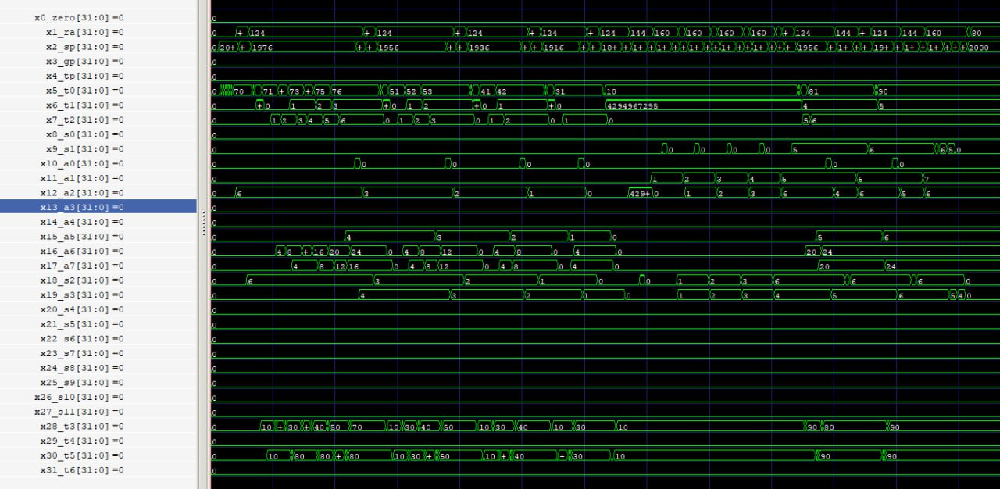
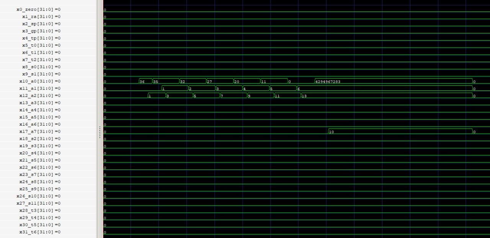

Computer Organization - Spring 2024
==============================================================
## Iran Univeristy of Science and Technology
## Assignment 1: Assembly code execution on phoeniX RISC-V core

- Name:AmirHossein Momeni
- Team Members:arash ardam - amirhesam bagherie-AmirHossein Momeni
- Student ID: 400413332
- Date:24/5/2024

## Report
## soal 1 - QuickSort
This code snippet is an implementation of the quicksort algorithm in assembly language. Here is an explanation of the code:

1. The QUICKSORT function:
   - The QUICKSORT function is a recursive function that sorts an array using the quicksort algorithm.
   - It takes three parameters: the array arr, the starting index start, and the ending index end.
   - It first checks if the end index is less than the start index. If true, it jumps to the START_GT_END label.
   - Then it calls the PARTITION function to partition the array around a pivot element.
   - After partitioning, it recursively calls itself on the subarrays before and after the pivot (excluding the pivot element).
   - Finally, it returns when the base case is reached (when end < start).

2. The PARTITION function:
   - The PARTITION function is used by the quicksort algorithm to partition the array around a pivot element.
   - It takes three parameters: the array arr, the starting index start, and the ending index end.
   - It selects the pivot element as the last element of the array (arr[end]).
   - It then rearranges the elements of the array such that all elements less than the pivot are placed before it and all elements greater than or equal to the pivot are placed after it.
   - It uses two pointers, i and j, to iterate through the array and swap elements as needed.
   - Finally, it swaps the pivot element with the element at index i + 1 to place the pivot in its correct position.
   - It returns the index of the pivot element after partitioning.

3. The MAIN section:
   - In this section, an array of integers {10, 80, 30, 90, 40, 50, 70} is stored in memory.
   - The QUICKSORT function is called with the starting and ending indices of the array to initiate the sorting process.
   - Finally, an EXIT command is used to halt the program execution.

Overall, this code implements a basic quicksort algorithm in assembly language, dividing and conquering the array until it is sorted.

### soal 2 - IntegerSquareRoot
toozihate code 
### start
 * addad mored nazar (36) ro zakhire dar a0 karde 
 * dar a1 adad 0 zakhire
 * dar a2 addad 1 
 ### loop
 * dar har marhale loop be a1 = a1 +1 & a2 = a2 + 2 mishavad
 * addad a0 ra az a2 kam karde ta zamani ke meghdar ma manfi beshe
 * ba estefade az blt agar manfi shod az loop kharej mishavad
 ### end of loop 
 * meghdar a1 ra yeki kam karde ta javabe dorost be dast byad be dalil een ke dar marhale akhar addad manfi mishavad 
 